# n8n OAuth Flow Visual Diagrams

This document contains visual diagrams representing the OAuth flow in n8n using Mermaid.

## OAuth 2.0 Complete Flow Diagram

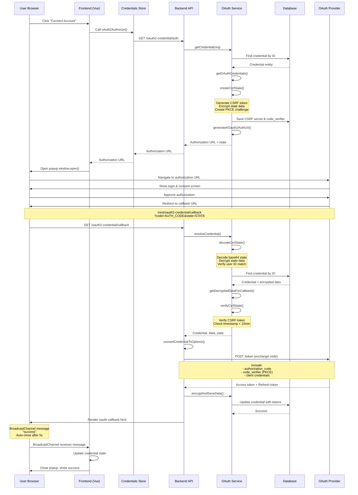

## OAuth 1.0a Complete Flow Diagram

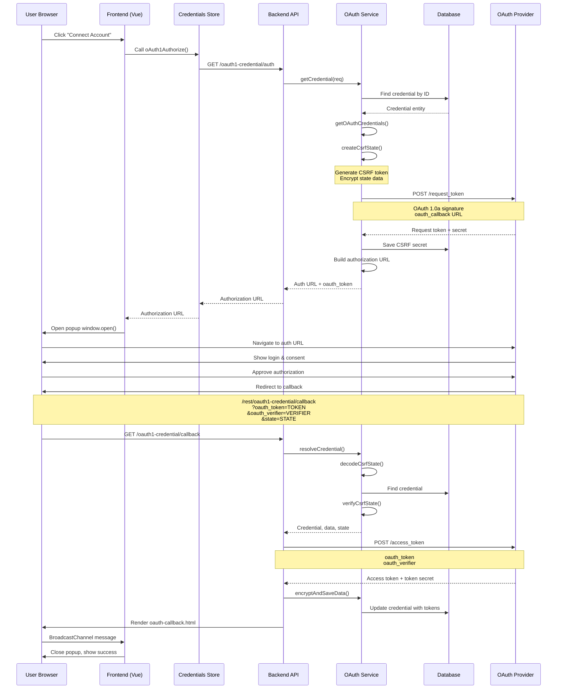

## Component Architecture Diagram

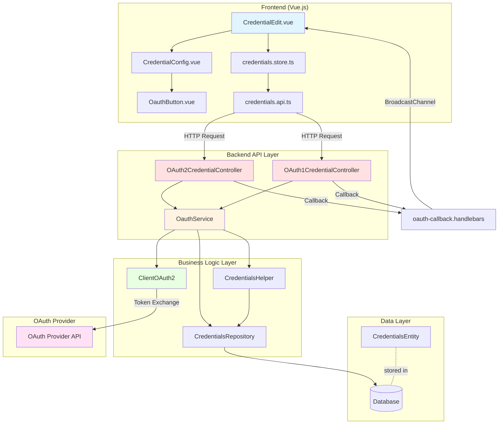

## OAuth 2.0 PKCE Flow Diagram

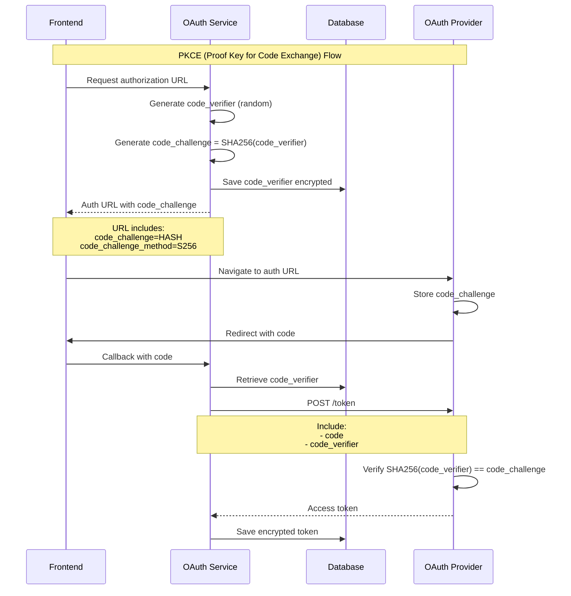

## Dynamic Client Registration Flow

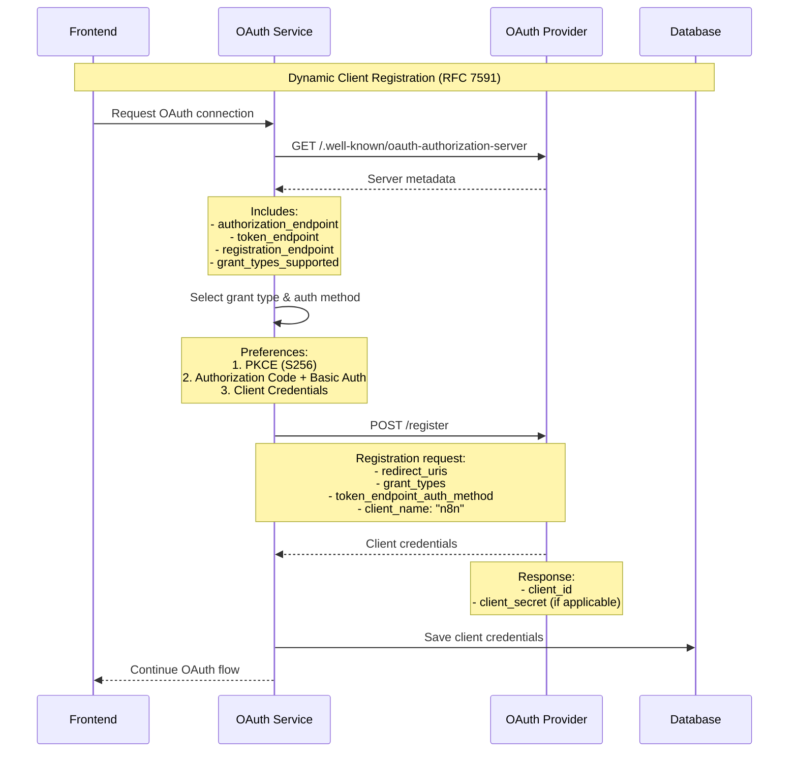

## File Organization Diagram

```mermaid
graph LR
    subgraph "Frontend Package"
        A[editor-ui/src/features/credentials/]
        A --> A1[components/CredentialEdit/]
        A --> A2[credentials.store.ts]
        A --> A3[credentials.api.ts]
        A1 --> A11[CredentialEdit.vue]
        A1 --> A12[CredentialConfig.vue]
        A1 --> A13[OauthButton.vue]
    end
    
    subgraph "Backend Package"
        B[cli/src/]
        B --> B1[controllers/oauth/]
        B --> B2[oauth/]
        B --> B3[credentials/]
        B --> B4[templates/]
        B1 --> B11[oauth2-credential.controller.ts]
        B1 --> B12[oauth1-credential.controller.ts]
        B2 --> B21[oauth.service.ts]
        B2 --> B22[validate-oauth-url.ts]
        B3 --> B31[credentials.controller.ts]
        B3 --> B32[credentials.service.ts]
        B3 --> B33[credentials-helper.ts]
        B4 --> B41[oauth-callback.handlebars]
        B4 --> B42[oauth-error-callback.handlebars]
    end
    
    subgraph "OAuth Client Library"
        C[@n8n/client-oauth2/src/]
        C --> C1[client-oauth2.ts]
        C --> C2[client-oauth2-token.ts]
        C --> C3[code-flow.ts]
    end
    
    subgraph "Database Package"
        D[@n8n/db/src/]
        D --> D1[entities/credentials-entity.ts]
        D --> D2[migrations/OAuth*.ts]
    end
    
    A3 -.HTTP.-> B11
    A3 -.HTTP.-> B12
    B11 --> B21
    B12 --> B21
    B21 --> B33
    B21 --> C1
    B33 --> D1
    
    style A fill:#e1f5ff
    style B fill:#ffe1e1
    style C fill:#e8ffe1
    style D fill:#fff3e1
```

## State Management Flow

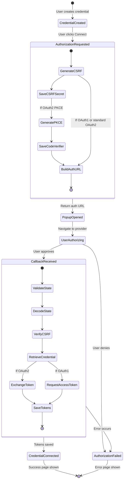

## Security Layers Diagram

```mermaid
graph TB
    subgraph "Security Measures"
        A[User Request] --> B{Authentication}
        B -->|Authenticated| C[Permission Check]
        B -->|Skip Auth Mode| D[Dynamic Credential Check]
        C -->|Authorized| E[Generate CSRF Token]
        D -->|Valid Bearer Token| E
        
        E --> F[Encrypt State Data]
        F --> G[Create OAuth URL]
        
        G --> H[URL Validation]
        H -->|Valid| I[User Authorization]
        H -->|Invalid| J[Reject - Security Error]
        
        I --> K[Callback Received]
        K --> L[Decode State]
        L --> M[Verify CSRF Token]
        M -->|Valid & Fresh| N[Verify User Match]
        M -->|Invalid/Expired| O[Reject - CSRF Failed]
        
        N -->|Match| P{OAuth Version}
        N -->|No Match| Q[Reject - Unauthorized]
        
        P -->|OAuth2 PKCE| R[Verify Code Verifier]
        P -->|OAuth2 Standard| S[Use Client Secret]
        P -->|OAuth1| T[Use Token Secret]
        
        R --> U[Exchange Code]
        S --> U
        T --> U
        
        U --> V[Encrypt Token]
        V --> W[Save to Database]
        
        style A fill:#e1f5ff
        style E fill:#fff3e1
        style F fill:#fff3e1
        style H fill:#ffe1e1
        style M fill:#ffe1e1
        style V fill:#e8ffe1
        style J fill:#ffcccc
        style O fill:#ffcccc
        style Q fill:#ffcccc
    end
```

## BroadcastChannel Communication

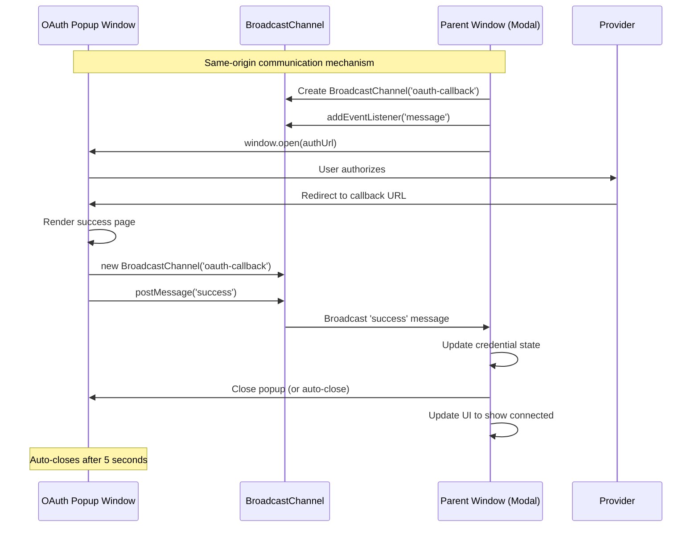

## Error Handling Flow

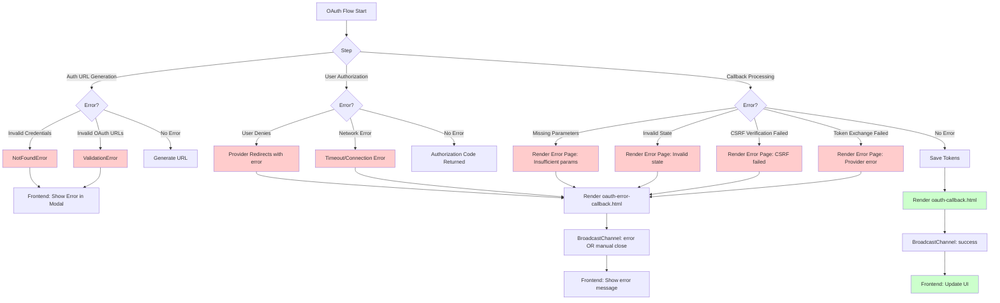

## Credential Type Inheritance

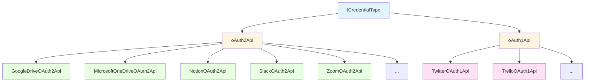

## Token Storage and Encryption

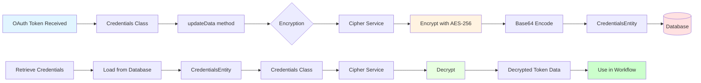

## Summary

These diagrams provide visual representations of:

1. **Sequence Diagrams**: Show the step-by-step flow of OAuth 1.0a and OAuth 2.0 authentication
2. **Architecture Diagrams**: Display the component structure and relationships
3. **Flow Diagrams**: Illustrate specialized flows like PKCE and dynamic client registration
4. **State Diagrams**: Show the state transitions during the OAuth process
5. **Security Diagrams**: Highlight the security layers and measures
6. **Communication Diagrams**: Explain BroadcastChannel usage for popup-parent communication
7. **Error Handling**: Map out error scenarios and handling
8. **Data Flow**: Show token encryption and storage

All diagrams use Mermaid syntax and can be rendered in GitHub, GitLab, or any Mermaid-compatible viewer.
